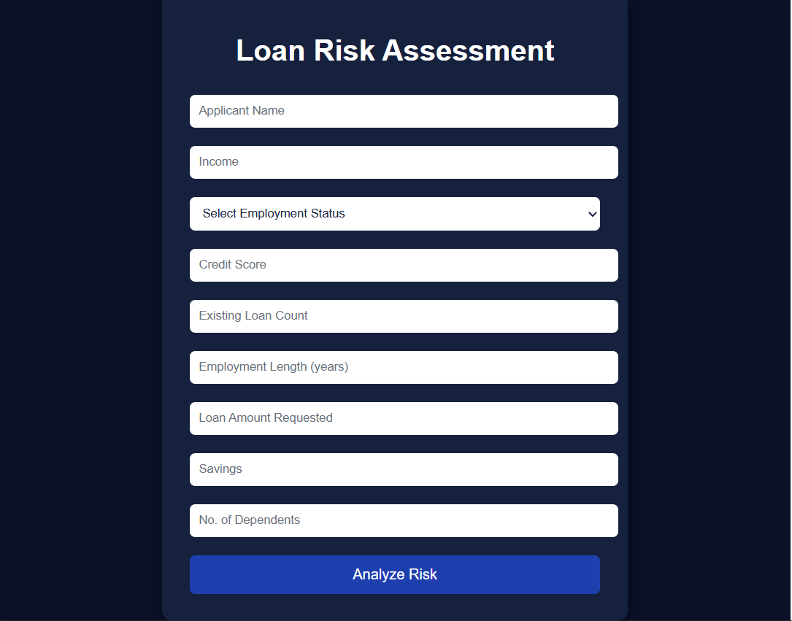
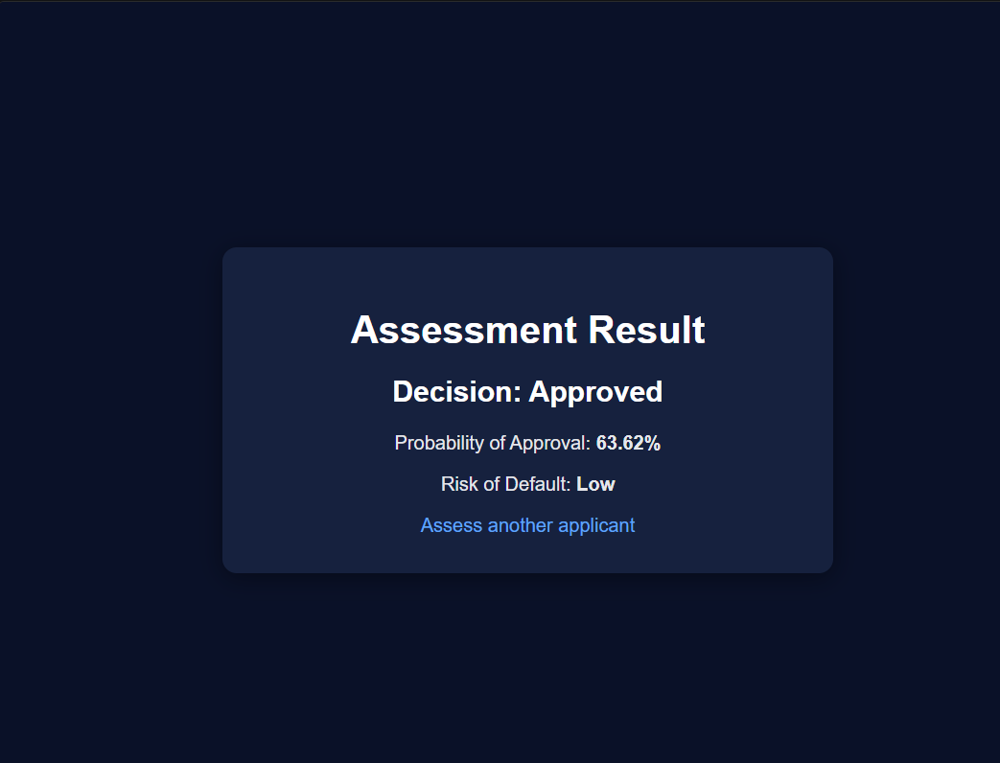

# Loan Risk Assessment App

A Flask web application that predicts loan approval probability, decision, and default risk using a machine learning model trained on applicant financial and employment data.

## Objective

To simulate a real-world loan underwriting workflow — allowing a user to submit applicant details through a web form and receive an instant, data-driven assessment of loan approval likelihood, along with the associated risk of default.

## Features

- Takes 8 applicant inputs: income, employment status, credit score, existing loan count, employment length, loan amount requested, savings, and number of dependents
- Predicts Probability of Approval (%), Final Decision (Approved / Rejected), and Risk of Default (Low / High)
- Validates all inputs on both the form and the backend (no negative values, credit score restricted to 300-900)
- Logs every submitted application into a MySQL database with a timestamp
- Simple, responsive UI with a navy blue theme
- REST API endpoint (/api/predict) for programmatic access - accepts JSON input and returns JSON predictions, so external clients (mobile apps, other services) can integrate without using the web form

## Screenshots

**Loan Application Form**

**Assessment Result**

## Tech Stack

Backend: Python, Flask
Machine Learning: scikit-learn (Random Forest Classifier), NumPy, Pandas
Database: MySQL
Frontend: HTML, CSS

## Setup Instructions

1. Clone this repository and navigate into the project folder
2. Create and activate a virtual environment
3. Install dependencies using pip install -r requirements.txt
4. Create a MySQL database named loan_db with an applications table (columns: id, applicant_name, income, employment_status, credit_score, existing_loan_count, employment_length, loan_amount_requested, savings, dependents, prediction_result, application_time)
5. Create a .env file in the project root and add your MySQL password like this: DB_PASSWORD=your_mysql_password_here
6. Run the app using python app.py
7. Open http://127.0.0.1:5000 in your browser for the web form, or send a POST request to http://127.0.0.1:5000/api/predict with JSON data for the REST API

## API Usage Example

POST /api/predict with JSON body:

{
  "income": 50000,
  "employment_status": "Employed",
  "credit_score": 700,
  "existing_loan_count": 1,
  "employment_length": 5,
  "loan_amount_requested": 200000,
  "savings": 30000,
  "dependents": 2
}

Returns:

{
  "decision": "Rejected",
  "probability": 49.71,
  "risk_of_default": "High"
}

## Key Challenges Solved

- Resolved a scikit-learn version incompatibility that caused pickled model loading to fail, by retraining and re-saving the model
- Fixed a Flask server startup issue caused by a missing application entry point
- Debugged MySQL schema mismatches between the application code and database
- Implemented layered input validation, both client-side and server-side
- Redesigned and retrained the machine learning pipeline to support an expanded feature set
- Moved database credentials out of source code into environment variables for security
- Added a REST API endpoint to support integration beyond the web form

## Note

This application runs on Flask's built-in development server, which is intended for local testing only and should not be used for production deployment.